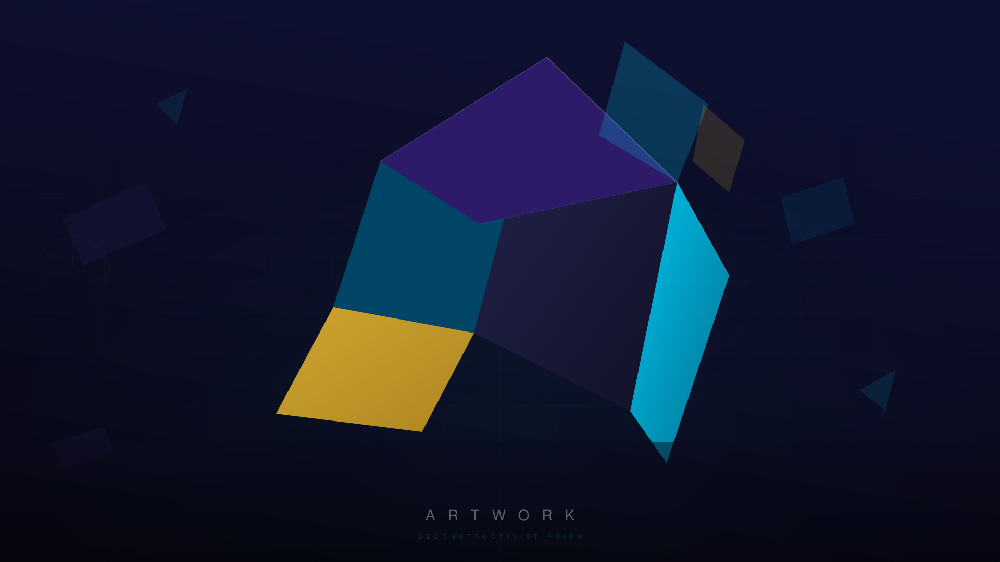
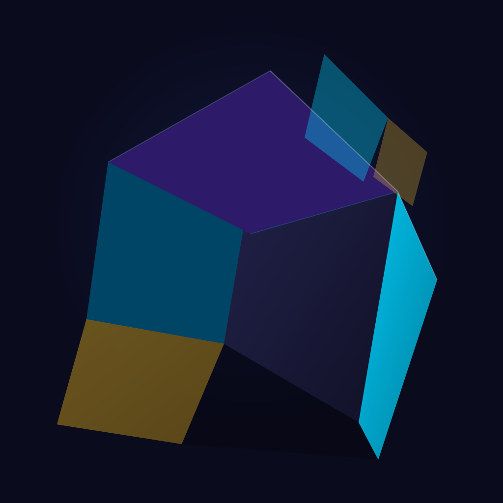

# Artwork

> **Disclaimer:** Word-Office is an independent open-source fork hosted on Codeberg and is not affiliated with, endorsed by, or controlled by any of the upstream projects or integration providers referenced in this repository (including Word Office, Ascensio System SIA, and others). Word-Office is entirely separate from "Word Office" (a GitHub organization associated with Nextcloud and IONOS). Word-Office maintains its own development roadmap, release cycle, and support channels.
>
All meaningful pull requests from Word Office and Word Office on GitHub have been reviewed and, where applicable, synced into this fork. An automated watch is in place that continuously monitors and integrates relevant upstream developments.

Abstract geometric artwork inspired by modern deconstructivist architecture.

## Deconstructivist Prism

An exploration of crystalline architectural forms through geometric abstraction.
Drawing inspiration from the works of Zaha Hadid, Daniel Libeskind, and Frank Gehry,
this series transforms the angular dynamism of deconstructivist buildings into
pure geometric compositions.

### Design Language
- **Faceted planes** suggesting 3D architectural volumes viewed from oblique angles
- **Asymmetric balance** creating visual tension and dynamism
- **Limited palette** of deep indigo, electric cyan, and warm gold against a void
- **Floating shards** evoking architectural fragments in motion

## Assets

| File | Description | Format |
|------|-------------|--------|
| `assets/banner.svg` | README banner (1280x320) | SVG |
| `assets/banner.png` | README banner rasterized (1280x320) | PNG |
| `assets/logo.svg` | Primary logo mark | SVG |
| `assets/teaser.svg` | Wide teaser composition | SVG |
| `assets/logo.png` | Logo rasterized (1024x1024) | PNG |
| `assets/teaser.png` | Teaser rasterized (1920x1080) | PNG |

## Banner

## Teaser

## Logo

## Tools
- [Inkscape](https://inkscape.org/) — SVG creation and export
