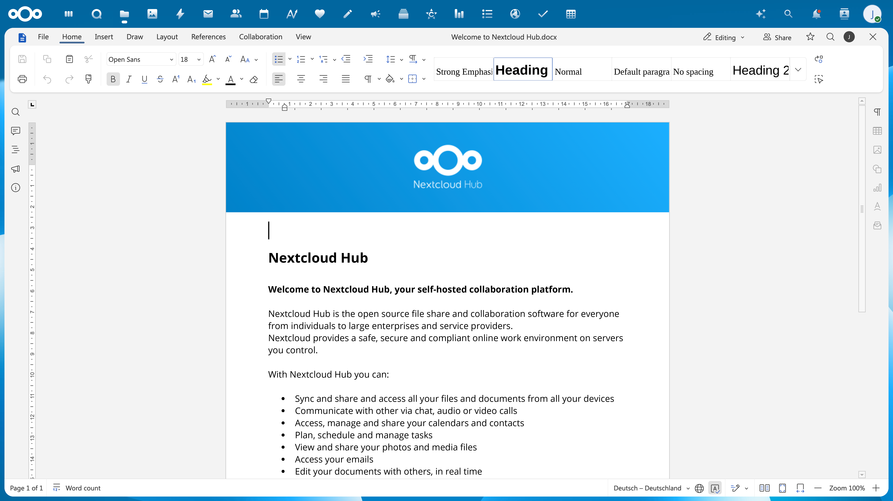

#  World Office app for Nextcloud

> **Disclaimer:** World Office is an independent open-source fork hosted on Codeberg and is not affiliated with, endorsed by, or controlled by any of the upstream projects or integration providers referenced in this repository (including World Office, Ascensio System SIA, and others). World Office is entirely separate from "World Office" (a GitHub organization associated with Nextcloud and IONOS). World Office maintains its own development roadmap, release cycle, and support channels.
>
All meaningful pull requests from World Office and World Office on GitHub have been reviewed and, where applicable, synced into this fork. An automated watch is in place that continuously monitors and integrates relevant upstream developments.

This app enables users to edit office documents from [Nextcloud](https://nextcloud.com) using World Office Docs packaged as Document Server

## Features ✨

The app allows to:

* ✍️ Create and edit text documents, spreadsheets and presentations
* 📝 Create and edit PDF forms.
* ✂️ Edit PDF files
* 📊 View diagram files
* 🤝 Share files to other users.
* 🔒 Protect documents with watermarks.
* 👥 Co-edit documents in real time: wo co-editing modes (Fast and Strict), Track Changes, comments, and built-in chat. Co-editing is also available between several federated Nextcloud instances connected to one Document Server.


### Supported formats

**For viewing:**

- **WORD**: DOC, DOCM, DOCX, DOT, DOTM, DOTX, EPUB, FB2, FODT, HML, HTM, HTML, HWP, HWPX, MD, MHT, MHTML, ODT, OTT, PAGES, RTF, STW, SXW, TXT, WPS, WPT, XML
- **CELL**: CSV, ET, ETT, FODS, NUMBERS, ODS, OTS, SXC, XLS, XLSB, XLSM, XLSX, XLT, XLTM, XLTX
- **SLIDE**: DPS, DPT, FODP, KEY, ODG, ODP, OTP, POT, POTM, POTX, PPS, PPSM, PPSX, PPT, PPTM, PPTX, SXI
- **PDF**: DJVU, DOCXF, OFORM, OXPS, PDF, XPS
- **DIAGRAM**: VSDM, VSDX, VSSM, VSSX, VSTM, VSTX

**For editing:**

- **WORD**: DOCM, DOCX, DOTM, DOTX
- **CELL**: XLSB, XLSM, XLSX, XLTM, XLTX
- **SLIDE**: POTM, POTX, PPSM, PPSX, PPTM, PPTX
- **PDF**: PDF

## Installing World Office Docs 📦

You will need an instance of World Office Docs (Document Server) that is resolvable and connectable both from Nextcloud and any end clients. World Office Document Server must also be able to POST to Nextcloud directly.

World Office Document Server and Nextcloud can be installed either on different computers, or on the same machine. If you use one machine, set up a custom port for Document Server as by default both World Office Document Server and Nextcloud work on port 80.


## Installing World Office app for Nextcloud 📥

The Nextcloud administrator can install the app from the in-built application market.
For that go to the user name and select **Apps**.

After that find **World Office** in the list of available applications and install it.

If the server with the Nextcloud installed does not have an Internet access, or if you need it for some other reason, the administrator can install the application manually.
To start using World Office Document Server with Nextcloud, the following steps must be performed:

1. Go to the Nextcloud server _apps/_ directory (or some other directory [used](https://docs.nextcloud.com/server/latest/admin_manual/apps_management.html#using-custom-app-directories)):
    ```bash
    cd apps/
    ```
2. Get the World Office app for Nextcloud.
There are several ways to do that:

    a. Download the latest signed version from the official store for [Nextcloud](https://apps.nextcloud.com/apps/worldoffice).

    b. Or you can download the latest signed version from the application [release page](https://codeberg.org/World Office/worldoffice-nextcloud/releases) on GitHub.

    c. Or you can clone the application source code and compile it yourself:
    ```bash
    git clone https://codeberg.org/World Office/worldoffice-nextcloud.git worldoffice
    cd worldoffice
    git submodule update --init --recursive
    ```
3. Build webpack (only if you chose to clone on the previous step):
    ```bash
    npm install
    npm run build
    ```
4. Install Composer dependencies (only if you chose to clone on the step 2):
    ```bash
    composer install
    ```
5. Change the owner to update the application right from Nextcloud web interface:
    ```bash
    chown -R www-data:www-data worldoffice
    ```
6. In Nextcloud open the `~/settings/apps/disabled` page with _Not enabled_ apps by administrator and click _Enable_ for the **World Office** application.

## Configuring World Office app for Nextcloud 🛠️

There are three ways to configure World Office integration settings in Nextcloud.

### User interface (UI)

Settings can be modified directly via the Nextcloud admin panel.

For example, in Nextcloud open the `~/settings/admin/worldoffice` page with administrative settings for **World Office** section.
Enter the following address to connect World Office Document Server:

```
https://<documentserver>/
```

Where the **documentserver** is the name of the server with the World Office Document Server installed.
The address must be accessible for the user browser and from the Nextcloud server.
The Nextcloud server address must also be accessible from World Office Document Server for correct work.

Sometimes your network configuration might not allow the requests between installed Nextcloud and World Office Document Server using the public addresses.
The _Advanced server settings_ allows to set the World Office Document Server address for internal requests from Nextcloud server and the returning Nextcloud address for the internal requests from World Office Document Server.
You need to enter them in the appropriate fields.

Starting from version 7.2, JWT is enabled by default and the secret key is generated automatically to restrict the access to World Office Docs and for security reasons and data integrity.
Specify your own **Secret key** in the Nextcloud administrative configuration.
In the World Office Docs config file, specify the same secret key and enable the validation.

### occ commands

Use the occ commands to set World Office settings for Nextcloud in the following way:

```sh
php occ config:app:set worldoffice {setting_key} --value={setting_value}
```

where `{setting_key}` is the key of the World Office integration setting, and `{setting_value}` is the corresponding value.

### config.php

Directly define settings in the `config/config.php` file under the `'worldoffice'` array:

``` php
"worldoffice" => array (
    {setting_key} => {setting_value},
)
```

where `{setting_key}` is the key of the World Office integration setting, and `{setting_value}` is the corresponding value.

The tables below list all available Nextcloud settings along with the supported configuration methods.

### Common settings

| Setting key                 | UI name / Description                                                                                                                                                                                                                | Example                                                                   | UI | occ | config.php |
|-----------------------------|--------------------------------------------------------------------------------------------------------------------------------------------------------------------------------------------------------------------------------------|---------------------------------------------------------------------------|----|-----|------------|
| `demo`                      | Connect to demo World Office Docs server                                                                                                                                                                                               | -                                                                         | +  | -   | -          |
| `DocumentServerUrl`         | World Office Docs address<br /><br />The connector uses this setting from the `config.php` file if no value is specified in the application configuration via UI or occ command.                                                       | "http://\<documentserver>/"                                               | +  | +   | +          |
| `DocumentServerInternalUrl` | World Office Docs address for internal requests from the server<br /><br />The connector uses this setting from the `config.php` file if no value is specified in the application configuration via UI or occ command.                 | "http://<internal_url>/"                                                  | +  | +   | +          |
| `StorageUrl`                | Nextcloud address available from document server                                                                                                                                                                                     | "http://\<storage_url>/"                                                  | +  | +   | +          |
| `jwt_secret`                | Secret key (leave blank to disable)                                                                                                                                                                                                  | "your_secret_key"                                                         | +  | +   | +          |
| `jwt_header`                | JWT header                                                                                                                                                                                                                           | "AuthorizationJWT"                                                        | +  | +   | +          |
| `sameTab`                   | Open file in the same tab<br /><br />The **Open in World Office** action will be added to the file context menu. You can specify this action as default and it will be used when the file name is clicked for the selected file types. | false                                                                     | +  | +   | -          |
| `enableSharing`             | Enable sharing<br /><br />If you forcibly enable this setting  via occ command, the editors will be opened in a new tab even when `sameTab === true`, which is not the intended behavior.                                            | true                                                                      | +  | +   | -          |
| `preview`                   | Use World Office to generate a document preview                                                                                                                                                                                        | true                                                                      | +  | +   | -          |
| `advanced`                  | Provide advanced document permissions using World Office Docs                                                                                                                                                                          | true                                                                      | +  | +   | -          |
| `cronChecker`               | Enable background connection check to the editors                                                                                                                                                                                    | true                                                                      | +  | +   | -          |
| `emailNotifications`        | Enable e-mail notifications                                                                                                                                                                                                          | true                                                                      | +  | +   | -          |
| `versionHistory`            | Keep metadata for each version once the document is edited                                                                                                                                                                           | true                                                                      | +  | +   | -          |
| `protection`                | Enable document protection                                                                                                                                                                                                           | Possible values: `owner,` `all`. Any other value will default to `owner`. | +  | +   | -          |
| `groups`                    | Allow the following groups to access the editors                                                                                                                                                                                     | '["admin", "editors"]'                                                    | +  | +   | -          |
| `verify_peer_off`           | Disable certificate verification                                                                                                                                                                                                     | true                                                                      | +  | +   | +          |
| `unknownAuthor`             | Unknown author display name                                                                                                                                                                                                          | "Guest User"                                                              | +  | +   | -          |
| `jwt_leeway`                | Defines the allowable leeway in JWT checks (measured in seconds).                                                                                                                                                                    | 60                                                                        | -  | -   | +          |
| `limit_thumb_size`          | Defines the maximum size of a thumbnail (measured in bytes).                                                                                                                                                                         | 104857600                                                                 | -  | -   | +          |
| `disable_download`          | Specifies whether to disable file downloads or not.                                                                                                                                                                                  | true                                                                      | -  | -   | +          |
| `editors_check_interval`    | Defines the interval for checking the availability of editors using cron (measured in seconds).                                                                                                                                      | 86400                                                                     | -  | -   | +          |
| `jwt_expiration`            | Defines the JWT expiration (measured in seconds).                                                                                                                                                                                    | 5                                                                         | -  | -   | +          |

### Customization settings

| Setting key                  | UI name / Description                               | Example                                                                                                                   | UI | occ | config.php |
|------------------------------|-----------------------------------------------------|---------------------------------------------------------------------------------------------------------------------------|----|-----|------------|
| `customizationChat`          | Display Chat menu button                            | false                                                                                                                     | +  | +   | -          |
| `customizationCompactHeader` | Display the header more compact                     | true                                                                                                                      | +  | +   | -          |
| `customizationFeedback`      | Display Feedback & Support menu button              | false                                                                                                                     | +  | +   | -          |
| `customizationForcesave`     | Keep intermediate versions when editing (forcesave) | false                                                                                                                     | +  | +   | -          |
| `customizationHelp`          | Display Help menu button                            | false                                                                                                                     | +  | +   | -          |
| `customizationReviewDisplay` | Review mode for viewing                             | Possible values: `original`, `markup`, `final`. The default value is `original`.                                          | +  | +   | -          |
| `customizationTheme`         | Default editor theme                                | Possible values: `theme-system`, `theme-light`, `theme-classic-light`, `theme-dark`, `theme-contrast-dark`, `theme-white`, `theme-night`. | +  | +   | -          |
| `customization_macros`       | Run document macros                                 | false                                                                                                                     | +  | +   | -          |
| `customization_plugins`      | Enable plugins                                      | false                                                                                                                     | +  | +   | -          |

### Watermark settings

| Setting key            | UI name / Description                                   | Example                                                                        | UI | occ | config.php |
|------------------------|---------------------------------------------------------|--------------------------------------------------------------------------------|----|-----|------------|
| `watermark_enabled`    | Enable watermarking                                     | yes                                                                            | +  | +   | -          |
| `watermark_text`       | Watermark text                                          | "{userId}, {date}"<br /><br />Supported tags: `{userId}`, `{userDisplayName}`, `{email}`, `{date}`, `{themingName}`. | +  | +   | -          |
| `watermark_allGroups`  | Show watermark for users of groups                      | -                                                                              | +  | -   | -          |
| `watermark_allTags`    | Show watermark on tagged files.                         | -                                                                              | +  | -   | -          |
| `watermark_linkAll`    | Show watermark for all link shares                      | yes                                                                            | +  | +   | -          |
| `watermark_shareAll`   | Show watermark for all shares                           | yes                                                                            | +  | +   | -          |
| `watermark_linkSecure` | Show watermark for download hidden shares               | -                                                                              | +  | -   | -          |
| `watermark_linkRead`   | Show watermark for read only link shares                | -                                                                              | +  | -   | -          |
| `watermark_linkTags`   | Show watermark on link shares with specific system tags | -                                                                              | +  | -   | -          |

## Checking the connection ☑️

You can check the connection to World Office Document Server by using the following occ command:

`occ worldoffice:documentserver --check`

You will see a text either with information about the successful connection or the cause of the error.

## Advanced document permissions 🔒

The Advanced tab allows you to grant additional access rights only to those users specified in the Sharing tab without the ability to re-share the file. Depending on the chosen Custom permission option and the file type (docx, pptx, xlsx), you can grant different additional rights.

* If the **DOCX** file is shared with the Custom permission (Edit enabled, Share disabled) in the Sharing tab, you can set the given rights to only reviewing (**Review only**) or only commenting (**Comment only**) in the Advanced tab.
* If the **XLSX** file is shared with the Custom permission (Edit enabled, Share disabled) in the Sharing tab, you can set the given rights to only commenting (**Comment only**) or applying filtering for everyone (**Global filter**, which is enabled by default) in the Advanced tab.
* If the **PPTX** file is shared with the Custom permission (Edit enabled, Share disabled) in the Sharing tab, you can set the given rights to only commenting (**Comment only**) in the Advanced tab.
* If the **PDF** file is shared with the Custom permission (Edit enabled, Share disabled) in the Sharing tab, you can set the given rights to only filling out (**Form Filling**) in the Advanced tab.

## How it works ⚙️

* When creating a new file, the user navigates to a document folder within Nextcloud and clicks the **Document**, **Spreadsheet** or **Presentation** item in the _new_ (+) menu.

* The browser invokes the `create` method in the `/lib/Controller/EditorController.php` controller.
This method adds the copy of the file from the assets folder to the folder the user is currently in.

* Or, when opening an existing file, the user navigates to it within Nextcloud and selects the **Open in World Office** menu option.

* A new browser tab is opened and the `index` method of the `/lib/Controller/EditorController.php` controller is invoked.

* The app prepares a JSON object with the following properties:

  * **url** - the URL that World Office Document Server uses to download the document;
  * **callbackUrl** - the URL that World Office Document Server informs about status of the document editing;
  * **documentServerUrl** - the URL that the client needs to respond to World Office Document Server (can be set at the administrative settings page);
  * **key** - the etag to instruct World Office Document Server whether to download the document again or not;

* Nextcloud takes this object and constructs a page from `templates/editor.php` template, filling in all of those values so that the client browser can load up the editor.

* The client browser makes a request for the javascript library from World Office Document Server and sends World Office Document Server the DocEditor configuration with the above properties.

* Then World Office Document Server downloads the document from Nextcloud and the user begins editing.

* World Office Document Server sends a POST request to the _callbackUrl_ to inform Nextcloud that a user is editing the document.

* When all users and client browsers are done with editing, they close the editing window.

* After 10 seconds of inactivity, World Office Document Server sends a POST to the _callbackUrl_  letting Nextcloud know that the clients have finished editing the document and closed it.

* Nextcloud downloads the new version of the document, replacing the old one.


## Known issues ❓

* Adding the storage using the **External storages** app has issues with the co-editing in some cases.
If the connection is made using the same authorization keys (the _Username and password_ or _Global credentials_ authentication type is selected), then the co-editing is available for the users.
If different authorization keys are used (_Log-in credentials, save in database_ or _User entered, store in database_ authentication options), the co-editing is not available.
When the _Log-in credentials, save in session_ authentication type is used, the files cannot be opened in the editor.

* If you are using a self-signed certificate for your **Document Server**, Nextcloud will not validate such a certificate and will not allow connection to/from **Document Server**. This issue can be solved in two ways.

    You can check the '**Disable certificate verification (insecure)**' box on the World Office administration page, Server settings section, within your Nextcloud.

    Another option is to change the Nextcloud config file manually. Locate the Nextcloud config file (_/nextcloud/config/config.php_) and open it. Insert the following section to it:

    ```php
    'worldoffice' => array (
        'verify_peer_off' => true
    )
    ```
    This will disable the certificate verification and allow Nextcloud to establish connection with **Document Server**.

    Please remember that this is a temporary insecure solution and we strongly recommend that you replace the certificate with the one issued by some CA. Once you do that, do not forget to uncheck the corresponding setting box or remove the above section from the Nextcloud config file.

* If the editors don't open or save documents after a period of proper functioning, the reason can be a problem in changing network settings or disabling any relevant services, or issues with the SSL certificate.

    To solve this, we added an asynchronous background task which runs on the server to check availability of the editors. It allows testing the connection between your **Nextcloud instance** and **World Office Document Server**, namely availability of server addresses and the validity of the JWT secret are being checked.

    If any issue is detected, the World Office app for Nextcloud (consequently, the ability to create and open files) will be disabled. As a Nextcloud admin, you will get the corresponding notification.

    This option allows you to avoid issues when the server settings become incorrect and require changes.

    By default, this background task runs once a day. If necessary, you can change the frequency. To do so, open the Nextcloud config file (_/nextcloud/config/config.php_). Insert the following section and enter the required value in minutes:

    ```php
    'worldoffice' => array (
        'editors_check_interval' => 3624
    )
    ```
    To disable this check running, enter 0 value.

* When accessing a document without download permission, file printing and using the system clipboard are not available. Copying and pasting within the editor is available via buttons in the editor toolbar and in the context menu.

* When a file is opened for editing in World Office while being simultaneously edited in other tools, changes may be overwritten or lost. To avoid conflicts and ensure smooth collaboration, we recommend using the Temporary File Lock application: https://apps.nextcloud.com/apps/files_lock. This helps prevent parallel editing and safeguards your work.

